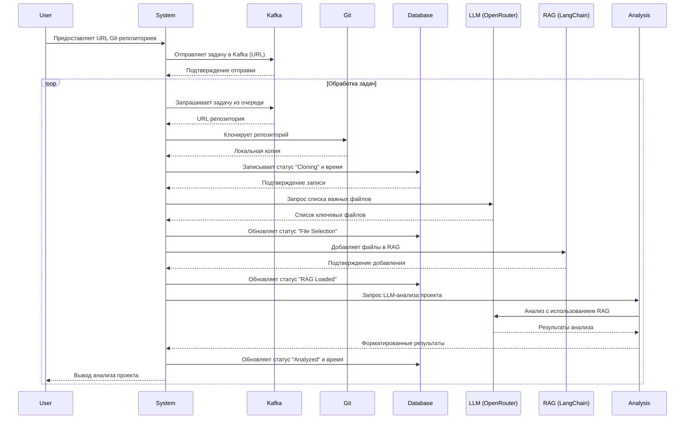

# Algotrading monitor



### Обновления в архитектуре:

1. **Kafka (K):**
   - Добавлен как очередь задач.
   - Пользователь отправляет URL в систему, а она публикует задачу в Kafka.
   - Система асинхронно забирает задачи из Kafka и обрабатывает их.

2. **Database (DB):**
   - Хранит информацию о репозиториях:
     - URL репозитория
     - Статус обработки (например, "Cloning", "File Selection", "RAG Loaded", "Analyzed")
     - Время начала/окончания этапов
   - Система обновляет статус и время на каждом этапе.

3. **Поток данных:**
   - Пользователь → Kafka → Система забирает задачу.
   - Клонирование → выбор файлов → загрузка в RAG → анализ.
   - На каждом шаге обновляется база данных.
   - Результат возвращается пользователю.

### Предполагаемая структура базы данных:
```sql
CREATE TABLE repositories (
    id SERIAL PRIMARY KEY,
    url VARCHAR(255) NOT NULL,
    status VARCHAR(50) NOT NULL,
    created_at TIMESTAMP DEFAULT CURRENT_TIMESTAMP,
    updated_at TIMESTAMP DEFAULT CURRENT_TIMESTAMP
);
```

### Используемые технологии:
- **Kafka**: Для асинхронной обработки задач.
- **Database**: Любая СУБД (PostgreSQL, MySQL и т.д.) для хранения статуса и времени.
- **LangChain**: Для RAG.
- **OpenRouter**: Для LLM.

Если нужно уточнить детали (например, структуру топиков в Kafka или схему базы данных), дайте знать!