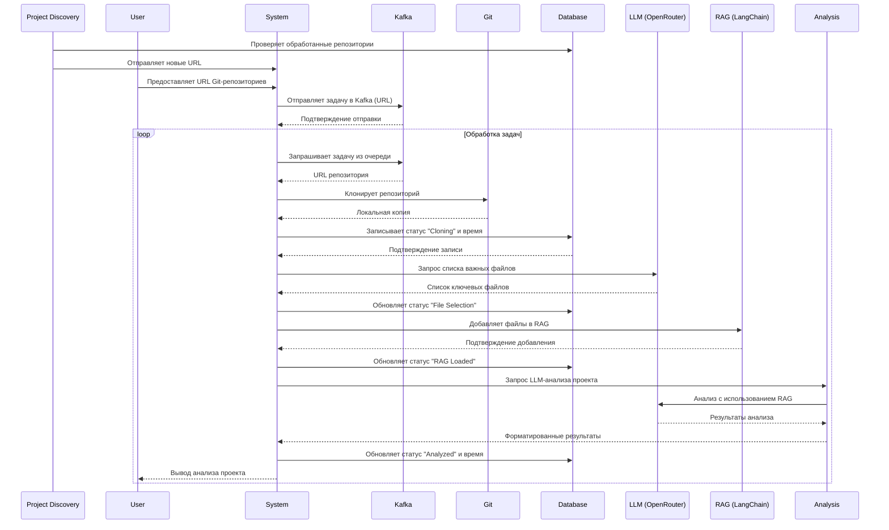

# Algotrading monitor



### Обновления в архитектуре:

1. **Project Discovery (PD):**
   - Автоматически ищет новые алготрейдинговые проекты.
   - Проверяет в базе данных, не был ли проект уже проанализирован.
   - Отправляет новые проекты в систему для обработки.

2. **Kafka (K):**
   - Добавлен как очередь задач.
   - Пользователь отправляет URL в систему, а она публикует задачу в Kafka.
   - Система асинхронно забирает задачи из Kafka и обрабатывает их.

3. **Database (DB):**
   - Хранит информацию о репозиториях:
     - URL репозитория
     - Статус обработки (например, "Cloning", "File Selection", "RAG Loaded", "Analyzed")
     - Время начала/окончания этапов
   - Система обновляет статус и время на каждом этапе.

4. **Поток данных:**
   - Project Discovery/Пользователь → Kafka → Система забирает задачу.
   - Клонирование → выбор файлов → загрузка в RAG → анализ.
   - На каждом шаге обновляется база данных.
   - Результат возвращается пользователю.

### Выполненные задачи:

1. **Настройка Kafka:**
   - Установлен Kafka и Zookeeper через Docker Compose
   - Сконфигурированы основные параметры:
     - KAFKA_BROKER_ID: 1
     - KAFKA_ZOOKEEPER_CONNECT: zookeeper:2181
     - KAFKA_ADVERTISED_LISTENERS: PLAINTEXT://localhost:9092
     - KAFKA_NUM_PARTITIONS: 5
     - KAFKA_DEFAULT_REPLICATION_FACTOR: 1
   - Порты: Kafka (9092), Zookeeper (2181)

2. **Настройка топиков Kafka:**
   - Создан топик repository.discovery для обнаружения новых проектов
   - Настроены параметры топиков:
     - Количество партиций: 5
     - Фактор репликации: 1
     - Автоматическое создание топиков отключено

### Предполагаемая структура базы данных:
```sql
CREATE TABLE repositories (
    id SERIAL PRIMARY KEY,
    url VARCHAR(255) NOT NULL,
    status VARCHAR(50) NOT NULL,
    created_at TIMESTAMP DEFAULT CURRENT_TIMESTAMP,
    updated_at TIMESTAMP DEFAULT CURRENT_TIMESTAMP
);
```

### Используемые технологии:
- **Kafka**: Для асинхронной обработки задач.
- **Database**: Любая СУБД (PostgreSQL, MySQL и т.д.) для хранения статуса и времени.
- **LangChain**: Для RAG.
- **OpenRouter**: Для LLM.

Если нужно уточнить детали (например, структуру топиков в Kafka или схему базы данных), дайте знать!

### Используемые команды:

1. **Docker Compose команды:**
   ```bash
   # Запуск Kafka и Zookeeper
   docker-compose up -d

   # Проверка статуса контейнеров
   docker-compose ps

   # Просмотр логов
   docker-compose logs -f

   # Остановка сервисов
   docker-compose down
   ```

2. **Kafka команды:**
   ```bash
   # Создание топика repository.discovery
   docker-compose exec kafka kafka-topics --create \
     --topic repository.discovery \
     --bootstrap-server localhost:9092 \
     --partitions 5 \
     --replication-factor 1

   # Просмотр списка топиков
   docker-compose exec kafka kafka-topics --list \
     --bootstrap-server localhost:9092

   # Просмотр деталей топика
   docker-compose exec kafka kafka-topics --describe \
     --topic repository.discovery \
     --bootstrap-server localhost:9092
   ```