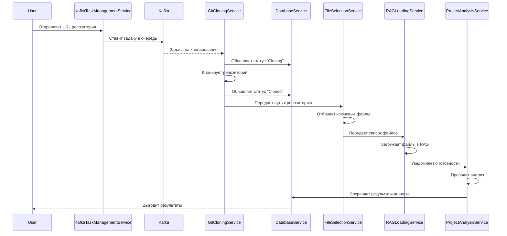

Для описания сервисов проекта и их взаимодействия я использую диаграмму последовательности в Mermaid. Эта диаграмма показывает, как сервисы обмениваются данными и в каком порядке выполняются действия. Вот список сервисов и их взаимодействие:

### Сервисы проекта:
1. **Git Cloning Service** — клонирует репозиторий по заданию из Kafka.
2. **File Selection Service** — отбирает ключевые файлы из склонированного репозитория.
3. **RAG Loading Service** — загружает файлы в RAG.
4. **Project Analysis Service** — анализирует данные и формирует результаты.
5. **Database Service** — хранит статусы и результаты анализа.
6. **Kafka Task Management Service** — принимает запросы от пользователя и управляет задачами через Kafka.

### Диаграмма Mermaid:

### Объяснение работы сервисов:
- **Пользователь (User)** отправляет URL репозитория в **Kafka Task Management Service**.
- **Kafka Task Management Service** добавляет задачу в очередь через **Kafka**.
- **Git Cloning Service** забирает задачу из **Kafka**, обновляет статус в **Database Service** на "Cloning", клонирует репозиторий, затем обновляет статус на "Cloned" и передает путь к репозиторию в **File Selection Service**.
- **File Selection Service** анализирует репозиторий, отбирает ключевые файлы и отправляет их в **RAG Loading Service**.
- **RAG Loading Service** загружает файлы в RAG и уведомляет **Project Analysis Service** о готовности.
- **Project Analysis Service** выполняет анализ данных и сохраняет результаты в **Database Service**.
- **Database Service** хранит результаты и возвращает их пользователю.

Эта диаграмма наглядно демонстрирует поток данных и последовательность действий между сервисами в проекте.